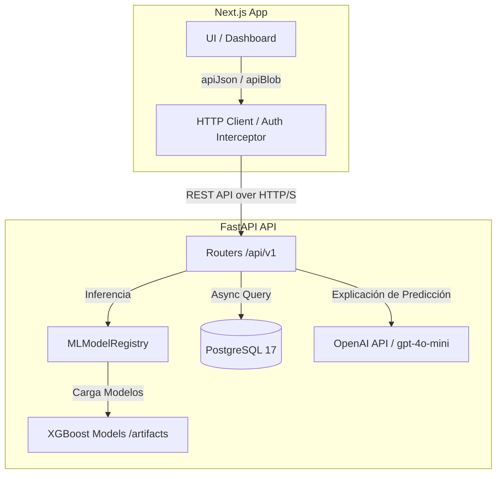

# Aplicación de Predicción de Demanda para Veterinarias

Sistema que predice la demanda de venta por categoría de producto en una
veterinaria (día, semana o mes) y explica el porqué de cada predicción, para
apoyar decisiones de reposición de inventario.

[](https://www.youtube.com/watch?v=FdomcplaQsI)

## Problema

Hoy la reposición de stock en una veterinaria se decide "a ojo", sin un
histórico analizado. Esto genera quiebres de stock en temporada alta o
capital inmovilizado en exceso de inventario. Además, el dato crudo con el
que se parte (ventas diarias por categoría) no es utilizable por un modelo
tal cual llega: tiene huecos de fechas, valores inconsistentes y ninguna
señal de tendencia o estacionalidad todavía construida.

## Solución

Una aplicación web que:

- Ingiere el historial real de ventas (carga manual o por archivo CSV/XLSX).
- Transforma ese historial en variables predictivas (lags, medias móviles,
  variables de calendario, codificación de categoría).
- Entrena y versiona un modelo XGBoost, activando automáticamente la versión
  con mejor error de prueba (MAE).
- Predice la demanda por categoría y **explica** cada predicción (rango de
  confianza, comparación con el stock actual y con el mismo día de la semana
  anterior).
- Genera reportes en PDF y gestiona alertas de stock crítico.

## Arquitectura



Detalle completo en [`docs/01_architecture.md`](docs/01_architecture.md).

## Tecnologías


-9c27b0?style=for-the-badge)


## Estructura del proyecto

```
app-backend/src/app/    # API FastAPI
├── api/                # Routers /api/v1
├── ml/                 # Registro y entrenamiento del modelo
├── services/           # Lógica de negocio
├── db/                 # Modelos SQLAlchemy
└── schemas/            # Esquemas Pydantic

app-fronted/            # Next.js App Router
├── app/(dashboard)/    # Páginas del panel
├── components/         # Componentes de UI
└── lib/                # Clientes de API
```

## Colaboradores

- **Paul Sebastián** — pnaspudv@est.ups.edu.ec — [@PaulSebastian9720](https://github.com/PaulSebastian9720)
- **Jennyfer Ramírez** — jramirezs11@est.ups.edu.ec — [@jennyfer04ramirez](https://github.com/jennyfer04ramirez)
- **Juan Fernando** — jfernandoalz18@gmail.com — [@Juanfernando518](https://github.com/Juanfernando518)
- **Johnny** — 0996140701lol@gmail.com — [@johnny567w](https://github.com/johnny567w)

## Documentación adicional

¿Quieres conocer más sobre este proyecto? Revisa [`docs/`](docs/) — arquitectura,
glosario, setup y referencia de API. También hay un README propio con la
estructura específica de cada proyecto en [`app-backend/`](app-backend/README.md)
y en [`app-fronted/`](app-fronted/README.md).
