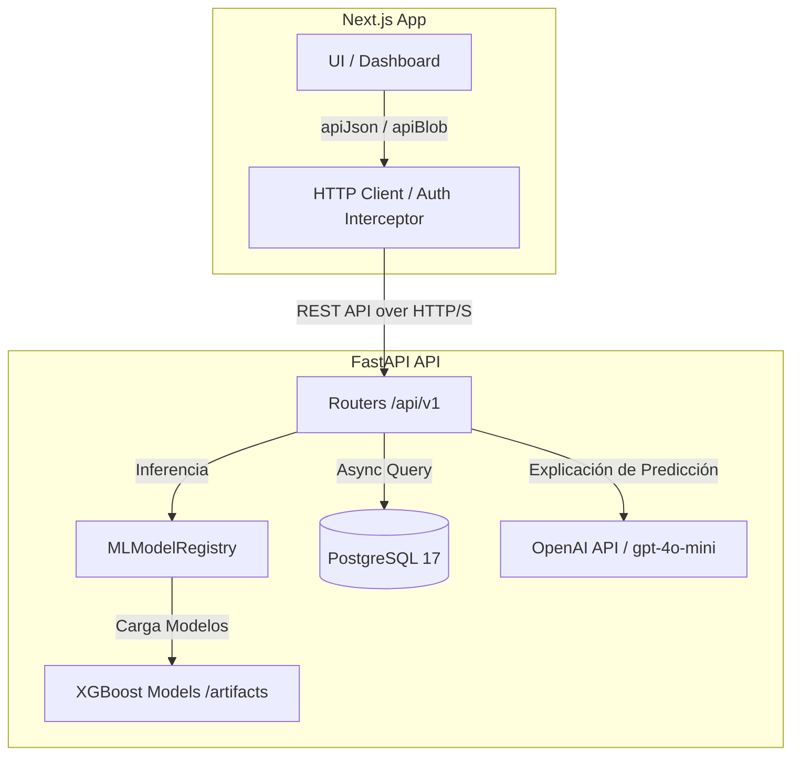

# Arquitectura del Sistema: Predicción de Demanda

Este documento detalla la estructura y flujos de comunicación del sistema de predicción de demanda de ventas.

## 1. Modelo de Comunicación y Componentes
El sistema sigue un modelo cliente-servidor desacoplado:
* **Frontend (Next.js 16 / React 19):** Interfaz de usuario que consume la API REST del backend. Maneja la sesión persistiendo tokens JWT en memoria/almacenamiento local y controlando la expiración.
* **Backend (FastAPI / Python 3.12):** API REST asíncrona que expone endpoints para autenticación, gestión de stock, ingesta de histórico y consumo de predicciones.
* **Base de Datos (PostgreSQL 17):** Almacén relacional persistente para usuarios, logs de inferencia, métricas, histórico de ventas y stock.
* **Engine de ML (XGBoost / Scikit-Learn):** Registro en memoria que carga los clasificadores entrenados durante el ciclo de vida de la aplicación (`lifespan` del backend) y responde consultas CPU-bound en hilos secundarios.

## 2. Diagrama de Arquitectura y Flujos

## 3. Flujo de Inferencia y Carga Asíncrona
Al arrancar el servidor FastAPI:
1. **Lifespan del Backend:** Se ejecuta el bloque `lifespan` en `main.py`. Este consulta la base de datos para identificar la versión activa en la tabla `model_versions`.
2. **Carga en Hilo Secundario:** Mediante `asyncio.to_thread`, se carga el registro del modelo XGBoost (`MLModelRegistry`) evitando bloquear el bucle de eventos principal (Event Loop) de FastAPI.
3. **Persistencia de Explicaciones:** Cuando se solicita una predicción por el endpoint `/predictions/day`, el modelo genera el pronóstico cuantitativo y se invoca la API de OpenAI para redactar un resumen explicativo. Todo se registra en la base de datos (`inference_logs` y `prediction_explanations`) antes de responder al frontend.

## 4. Estructura de Persistencia (Modelos DB)
La base de datos PostgreSQL 17 almacena el estado completo usando SQLAlchemy:
* **User (users):** Gestión de usuarios administradores y operadores (id, email, hashed_password, full_name, role).
* **ModelVersion (model_versions):** Registro de versiones activas y disponibles del modelo (is_active, artifacts_dir).
* **InferenceLog (inference_logs):** Auditoría técnica detallada de cada predicción (prediction_value, clasificador, created_at).
* **PredictionExplanation (prediction_explanations):** Resúmenes explicativos generados (resumen, factores, recomendación).
* **SalesHistory (sales_history):** Registro histórico de ventas cuantitativas (cantidad_vendida, precio_medio, dia).

## 5. Pipeline de Reentrenamiento Asíncrono
El reentrenamiento del modelo de Machine Learning se gestiona fuera del flujo HTTP principal:
* **Disparo manual/programado:** Un administrador inicia el proceso mediante la ruta `POST /api/v1/retraining`.
* **Procesamiento en Background:** FastAPI delega el script a `BackgroundTasks` para evitar timeouts.
* **Seguimiento por Eventos:** El progreso escribe entradas secuenciales en `pipeline_events` (ej. 'datos_cargados', 'entrenamiento_finalizado').

## 6. Patrones de Diseño y Estructura
* **Dependency Injection (DI):** Inyección de la sesión de BD, settings del `.env` y registro de ML mediante `Depends`.
* **Token Rotation Interceptor:** Patrón interceptor en `lib/api.ts`. Ante un error HTTP `401 Unauthorized`, suspende las peticiones en curso, ejecuta una petición `POST /auth/refresh` enviando el token de actualización persistido, y reintenta las consultas originales de forma transparente.
* **Dual Logging Middleware:** Intercepta cada petición entrante registrando la IP del cliente, método HTTP, latencia y código de estado tanto en consola (formato coloreado) como en la tabla `request_logs`.
